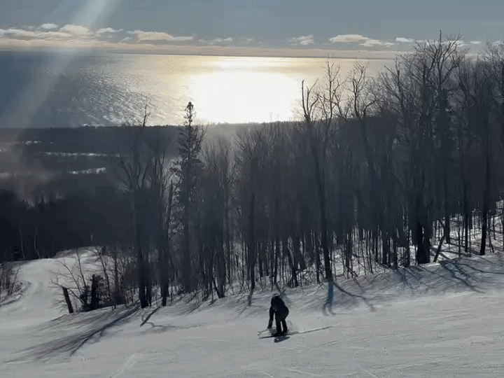

\

::: {#intro-heading}
I am a recent graduate from [Macalester College](https://www.macalester.edu/){target="_blank"} with a B.A. in Statistics. I am passionate about equity as it relates to data collection and analysis, especially in the world of sports analytics. I am currently seeking full-time opportunities in data analysis and statistics roles where I can apply my quantitative background to solve real-world problems and support data-driven decision-making.

\

## Education

Macalester College \| Saint Paul, MN   B.A. in Statistics \| Sept 2022 - May 2026
:::

## About Me

Outside of my studies, I enjoy watching Minnesota sports, staying active, playing my bagpipe, and enjoying winters (like a true life-long Minnesotan!)

::: {layout-nrow="2"}
{target="_blank"} (well, kinda!) ](image/frost.jpeg)

{target="_blank"}, Macalester's Women's/Gender Inclusive club soccer team that I helped lead in college!](image/clems.jpeg)

)! Here we are in Winnipeg, where our pipe band recieved first place.](image/bagpipe.jpeg)

:::
