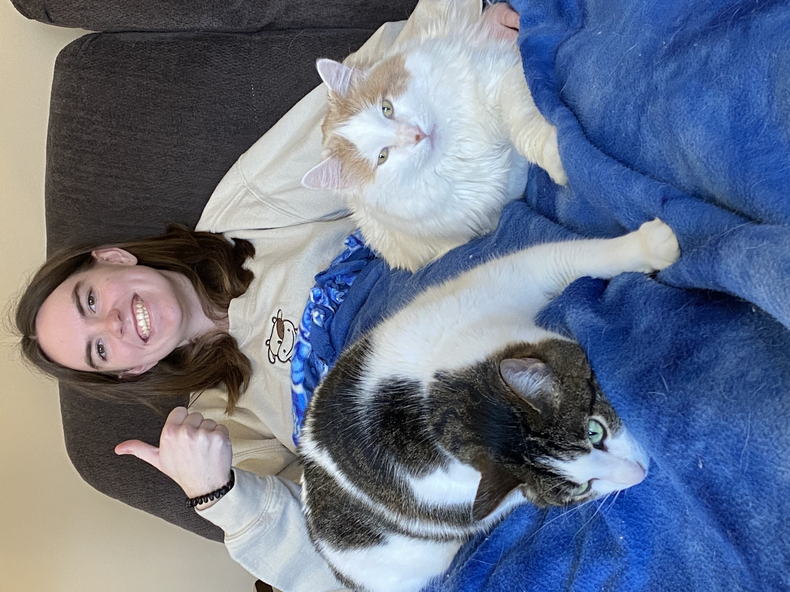

\

::: {#intro-heading}
I am a recent graduate from [Macalester College](https://www.macalester.edu/){target="_blank"} with a B.A. in Statistics. I am passionate about equity as it relates to data collection and analysis, especially in the world of sports analytics. I am currently seeking full-time opportunities in data analysis and statistics roles where I can apply my quantitative background to solve real-world problems and support data-driven decision-making.

\

## Education

Macalester College \| Saint Paul, MN   B.A. in Statistics \| Sept 2022 - May 2026
:::

## About Me

Outside of my studies, I enjoy Minnesota winters (like a true life-long Minnesotan!), spending time with my two cats, watching *Impractical Jokers*, and attending concerts in the Twin Cities area.

::: {layout-nrow="1"}
{target="_blank"}? Seems like shorts weather to me!](image/shortsdaysolo.jpg)

{target="_blank"} cutouts I made for my sophomore year dorm room.](image/kirk625ij2.jpg)

{target="_blank"} perform at the Fillmore Minneapolis.](image/katelynashleyjbass.jpg)
:::
